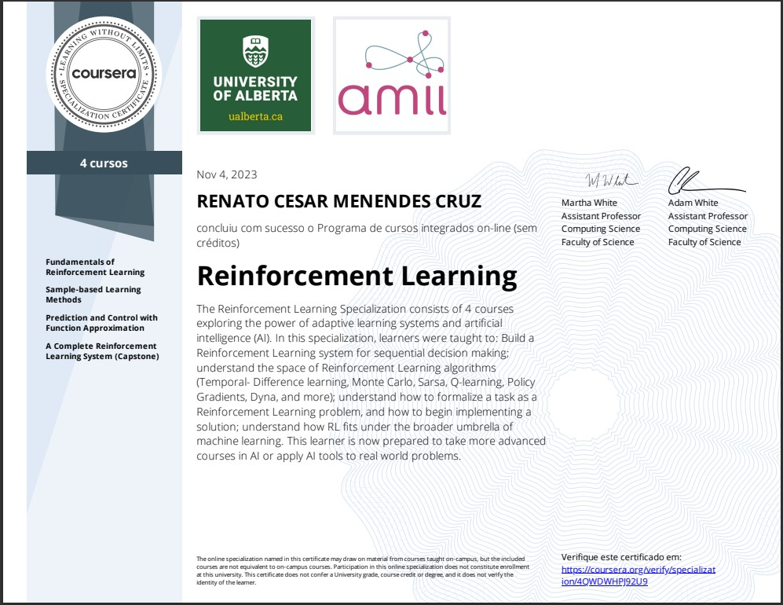

Aqui está a versão corrigida do `README.md` com links relativos para todos os arquivos internos:

---

# Reinforcement Learning Specialization

Este repositório contém minhas soluções e materiais relacionados à [Reinforcement Learning Specialization](https://www.coursera.org/specializations/reinforcement-learning) oferecida pela Universidade de Alberta e o Alberta Machine Intelligence Institute, ministrada pelos instrutores **Martha White** e **Adam White**.

## Conteúdo do Repositório

### 1. [Fundamentals of Reinforcement Learning](https://www.coursera.org/learn/fundamentals-of-reinforcement-learning)
- **Semana 1**
  - [Practice Quiz: Exploration-Exploitation](./01 - Fundamentals of Reinforcement Learning/Week 01/Practice Quiz Exploration-Exploitation.pdf)
  - [Notebook: Bandits and Exploration/Exploitation](https://github.com/renatomenendes/Reinforcement-Learning-Specialization/blob/main/01%20-%20Fundamentals%20of%20Reinforcement%20Learning/Week%201/Notebook_Bandits_and_Exploration_Exploitation/C1M1-Assignment1-v8.ipynb)
- **Semana 2**
  - [Practice Quiz: MDPs](./01 - Fundamentals of Reinforcement Learning/Week 02/Practice Quiz MDPs.pdf)
- **Semana 3**
  - [Practice Quiz: Value Functions and Bellman Equations](./01 - Fundamentals of Reinforcement Learning/Week 03/Practice Quiz Value Functions and Bellman Equations.pdf)
  - [Quiz: Value Functions and Bellman Equations](./01 - Fundamentals of Reinforcement Learning/Week 03/Quiz Value Functions and Bellman Equations.pdf)
- **Semana 4**
  - [Practice Quiz: Dynamic Programming](./01 - Fundamentals of Reinforcement Learning/Week 04/Practice Quiz Dynamic Programming.pdf)
  - [Notebook: Optimal Policies with Dynamic Programming](./01 - Fundamentals of Reinforcement Learning/Week 04/Notebook_Optimal_Policies_with_Dynamic_Programming/C1M4_Assignment2-v2.ipynb)

### 2. [Sample-based Learning Methods](https://www.coursera.org/learn/sample-based-learning-methods)
- **Semana 2**
  - [Quiz: Graded Quiz](.02 - Prediction and Control with Function Approximation/Week 02/Quiz Graded Quiz.pdf)
  - [Notebook: Blackjack](.02 - Prediction and Control with Function Approximation/Week 02/Notebook_Blackjack/Blackjack.ipynb)
- **Semana 3**
  - [Quiz: Practice Quiz](.02 - Prediction and Control with Function Approximation/Week 03/Quiz Practice Quiz.pdf)
  - [Notebook: Policy Evaluation with Temporal Difference Learning](.02 - Prediction and Control with Function Approximation/Week 03/Notebook_Policy_Evaluation_with_Temporal_Difference_Learning/C2M2-Assignment-v4.ipynb)
- **Semana 4**
  - [Quiz: Practice Quiz](.02 - Prediction and Control with Function Approximation/Week 04/Quiz Practice Quiz.pdf)
  - [Notebook: Q-Learning and Expected Sarsa](.02 - Prediction and Control with Function Approximation/Week 04/Notebook_Q-Learning_and_Expected_Sarsa/C2M3_Assignment2_v6.ipynb)
- **Semana 5**
  - [Quiz: Practice Assessment](.02 - Prediction and Control with Function Approximation/Week 5/Quiz Practice Assessment.png)
  - [Notebook: Dyna-Q and Dyna-Q+](.02 - Prediction and Control with Function Approximation/Week 5/Notebook_Dyna-Q_and_Dyna-Q+/Planning_Assignment-v2.ipynb)

### 3. [Prediction and Control with Function Approximation](https://www.coursera.org/learn/prediction-control-function-approximation)
- **Semana 1**
  - [Practice Quiz: On-policy Prediction with Approximation](./03 - Prediction and Control with Function Approximation/Week 01/Practice Quiz On-policy Prediction with Approximation.pdf)
  - [Notebook: Semi-gradient TD(0) with State Aggregation](./03 - Prediction and Control with Function Approximation/Week 01/Notebook_Semi-gradient_TD%280%29_with_State_Aggregation/C3M1_Assignment1-v8.ipynb)
- **Semana 2**
  - [Practice Quiz: Constructing Features for Prediction](./03 - Prediction and Control with Function Approximation/Week 02/Practice Quiz Constructing Features for Prediction.pdf)
  - [Notebook: Semi-gradient TD with a Neural Network](./03 - Prediction and Control with Function Approximation/Week 02/Notebook_Semi-gradient_TD_with_a_Neural_Network/C3M2_Assignment2-v7.ipynb)
- **Semana 3**
  - [Practice Quiz: Control with Approximation](./03 - Prediction and Control with Function Approximation/Week 03/Practice Quiz Control with Approximation.png)
  - [Notebook: Function Approximation and Control](./03 - Prediction and Control with Function Approximation/Week 03/Notebook_Function_Approximation_and_Control/Assignment3-v3.ipynb)
- **Semana 4**
  - [Practice Quiz: Policy Gradient Methods](#)
  - [Notebook: Average Reward Softmax Actor-Critic using Tile-coding](./03 - Prediction and Control with Function Approximation/Week 04/Notebook_Average_Reward_Softmax_Actor-Critic_using_Tile-coding/C3M4_Assignment4-v8.ipynb)

### 4. [A Complete Reinforcement Learning System (Capstone)](https://www.coursera.org/learn/complete-reinforcement-learning-system)
- **Semana 2**
  - [Notebook: MoonShot Technologies](./04 - A Complete Reinforcement Learning System (Capstone)/Week 02/Notebook_MoonShot_Technologies/Assignment1-v2.ipynb)
- **Semana 3**
  - [Quiz: Choosing the Right Algorithm](./04 - A Complete Reinforcement Learning System (Capstone)/Week 03/Quiz Choosing the Right Algorithm.pdf)
- **Semana 4**
  - [Quiz: Impact of Parameter Choices in RL](./04 - A Complete Reinforcement Learning System (Capstone)/Week 04/Quiz Impact of Parameter Choices in RL.pdf)
- **Semana 5**
  - [Notebook: Implement Your Agent](./04 - A Complete Reinforcement Learning System (Capstone)/Week 5/Notebook_Implement_Your_Agent/Course4ProgrammingAssignment2-v4.ipynb)
- **Semana 6**
  - [Notebook: Completing the Parameter Study](./04 - A Complete Reinforcement Learning System (Capstone)/Week 6/Notebook_Completing_the_Parameter_Study/C4M5_Assignment3-v9.ipynb)

## Instrutores
- **Martha White** - Professora Associada de Ciência da Computação, Universidade de Alberta.
- **Adam White** - Cientista de Pesquisa na DeepMind e Professor na Universidade de Alberta.

## Materiais de Referência
Aqui estão alguns recursos de referência que complementaram meu aprendizado:
- [Denny Britz - Reinforcement Learning](https://github.com/dennybritz/reinforcement-learning)
- [Shangtong Zhang - Reinforcement Learning: An Introduction](https://github.com/ShangtongZhang/reinforcement-learning-an-introduction)
- [LyWangPX - Sutton's Reinforcement Learning Exercises Solutions](https://github.com/LyWangPX/Reinforcement-Learning-2nd-Edition-by-Sutton-Exercise-Solutions)
- [David Silver - Reinforcement Learning Course](http://www0.cs.ucl.ac.uk/staff/d.silver/web/Teaching.html) ([YouTube Playlist](https://www.youtube.com/playlist?list=PLqYmG7hTraZDM-OYHWgPebj2MfCFzFObQ))

## Certificados

Aqui estão os certificados que obtive ao concluir a especialização:

<kbd></kbd>
<kbd></kbd>
<kbd></kbd>
<kbd></kbd>
<kbd></kbd>

---

© Copyright 2024 - Todos os direitos reservados à Renato Cesar Menendes Cruz.

---

Essa versão usa links relativos para todos os recursos internos do repositório, garantindo que o `README.md` seja mais portátil e fácil de manter.